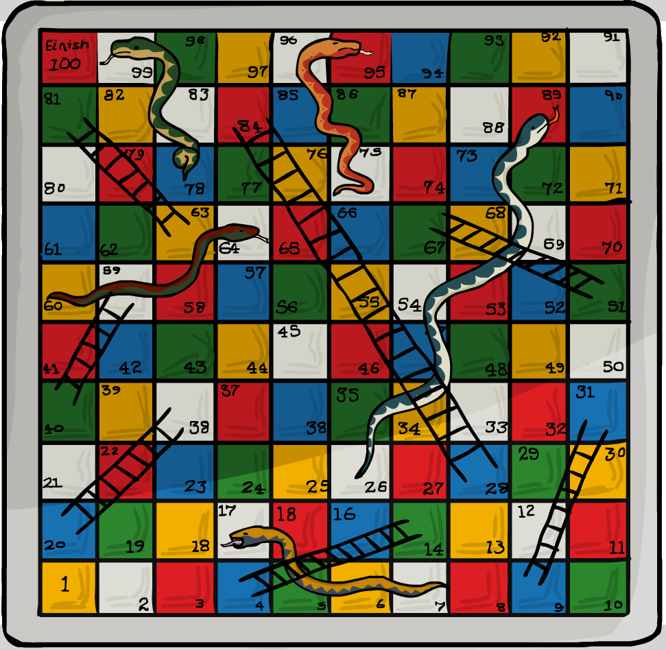
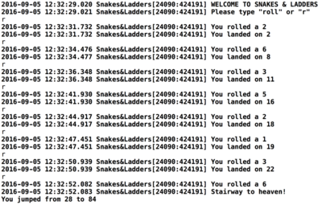
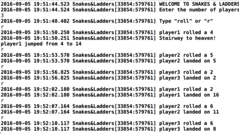
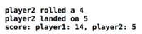

# Snakes-Ladders---Part-1-Assignment
Snake & Ladders

"Snakes & Ladders"

Note: We recommend that you attempt the Maths assignment first before doing Snakes & Ladders.

Rules of the Game

Snakes and Ladders is a simple children’s dice game. The goal of the game is to reach the finish square (100) before anyone else.

If a player lands on the bottom of a ladder, they move to the top of the ladder. Bonus!

But, if a player lands on a snake’s head, the player moves back to the snake’s tail. Bummer!

Part 1 Learning Outcomes

Can use NSNumber to wrap integers for inclusion in an NSDictionary
Can compare NSNumber values
Can use an NSDictionary for modeling moving squares when landing on ladders or snakes
Can override the default initializer init
Part 1 Goals

To create a single player command line game called Snakes & Ladders that models the kid's game
The app will wait for the user to type roll (or r for short) and will roll a random dice value between 1 and 6
Once the user rolls the app will move the user to a new square
The user will jump forward or go back depending whether they land on a ladder or snake
The app will inform the user which square they have landed on and whether they hit a snake or ladder along the way
When the user passes square 100 the game is over. Rnd the game and congratulate them.
Starter Instructions

Create a command line app called Snakes & Ladders. Create a while loop inside main.m to keep the game going.

Outside the while loop let's welcome the user and give them some simple instructions. For now just tell them to type "roll" or "r".

Using fgets parse the user's input as we did in the Maths app.

Create a Player Class

Before we get going we need to pause to think about how we should architect this app. To do this it helps to simplify the problem as much as possible.

Let's simplify by setting aside the winning state. We can also set aside the problem of moving squares when the player lands on ladders or snakes.

Let's concentrate on just generating a random dice value. Once we have that we can handle moving from the current square to a new square. We can start with a simple class structure. Later we can refactor if we find it helpful to split classes further.

Let's start with a simple NSObject subclass that we can call "Player".

Setting Up the Player Class

The Player class needs at least 2 things. An NSInteger property called something like currentSquare and a roll method.

roll should return void. To start, let's just create a random value between 1 and 6 in roll using arc4random_uniform() to do this. Log this dice value to the console.

We only need to create 1 player. So we should do this outside the while loop in main.m

Check the parsed input string for "roll" or "r" from main.m. If the user inputs one of these strings then call the roll method on the Player instance. Test to see whether roll works.

Set Up the Player's Basic Movement

We have to set the initial currentSquare property to 0. We do this by overriding the Player's init method.

When the user types "roll" increment the currentSquare's value inside roll. Do this by adding the random value to currentSquare. To test this log out the currently rolled value to the console and the incremented value.

Set Up the Game Logic

The essence of this game is simple. The player rolls a dice. They go to a square whose value is the sum of their current square plus the rolled value. A player can land on certain "special" squares. If they do, they move to a new square, either greater or lesser than the square they just landed on. If they don't land on a special square they stay where they just landed.

We have already modelled the first part in our Player class. We just need to model the behaviour of these "special" squares. How do we do this? Spent a couple moments thinking what data stucture (a class, array, dictionary, or set) you would use to store information on snakes. It should also know what square they are on and what square they land on the head. Then read below.

All we need to do is associate one number with another. If we look at the image of the board we see, for example, that there is an association between 4 and 14. So, if the player lands on square 4, they move to square 14.

The best way to model this is a dictionary. In this dictionary we can represent the special squares as keys. The associated value of these keys represent the new squares the player moves to.

So, inside our Player's init method set an NSDictionary property called, something like, gameLogic. Set it using the _ to be sure you are setting the backing store . Do not call self inside init. Create a key for the foot of each ladder and a key for each snake head. Make each key's associated value correspond to the top of the ladder or the snake tail. Use the Snakes & Ladders image (above) to get the required keys and values.

Note: Objective-C collections can only have objects as members. So you will have to wrap these numeric values inside the NSNumber class. Use the NSNumber literal syntax to do this.

*Tip: *Once you create the dictionary it is never changed (mutated). Dictionaries and arrays that are not mutated after creation should always be immutable types. Use Objective-C's dictionary literal syntax.

Handle Landing on Snakes or Ladders

Check whether the player has landed on a square corresponding to a key in the dictionary. Do this inside the implementation of roll. If the roll matches a key then set the currentSquare property to the associated value. If there is no match set currentSquare to the new rolled value.

Comparing with NSNumber: If you use == when comparing object references you will be comparing pointers. This is rarely what you want. You have 2 choices when doing a comparison with NSNumber. You can convert both values to primitives and then compare the primitives using ==. Or you can use NSNumber's method isEqualToNumber:. But to use isEqualToNumber: both values will have to be NSNumbers.

Handle the Console Output After Rolling

To inform the user in a console log we need a string to represent what happened as a result of the player's roll.

There are a few ways to handle this. My suggestion is to create a property in Player called something like output. This should be an NSString* type. Set this property from inside the roll method.

The output should include the following information: the dice value and the current square. You should also report whether they stepped on a ladder or snake. The output should look something like this:

Imgur

Handle the Game Over State

The game over state is either true or false. So, we should add a BOOL property to the Player called gameOver. If unset, a BOOL value is set to NO. But it's not a bad idea to make our intention explicit. Therefore, set our gameOver property to NO in the Player's init override.

Inside roll we are going to want to check to see if our random dice value takes us up to, or past, square 100. If it does, we can set the output property in Player to something appropriate.

In main.m we can check to see if, after our roll, gameOver is YES. If it is, we can output the message and break out of our while loop.

############################################################################################################################
<h1> Second part </h1>

Part 2 Learning Outcomes
Can refactor and move the input logic to an InputManager class
Can understand and implement a model manager class for handling an array of multiple player instances
Can expose methods and properties to do stuff with multiple player instances
Can keep track of the currently active player using an index property and the modulo operator
* Can use an NSMutableString to build up a complex string
Can use a BOOL flag
Can sanitize user input by lowercasing
Part 2 Goal
Add multi player support
Player's should be able to see a score output that summarizes the score of all players after each roll
Show the final score when a player wins and start the game again
Add quit functionality
Add a name Property to the Player Class
To handle multiple players we need to start by making a small alteration to the Player class. We need a name property so that we can identify the various players in our inputs and outputs to the console. So, go ahead and add an NSString* property called name.

Create a PlayerManager
It is best to create a manager class to handle multiple player instances. Let's call this NSObject subclass PlayerManager. PlayerManager will need an NSMutableArray property to hold the player instances. We can call this players. We will need to initialize this array in our init override.

We can initialize a single instance of PlayerManager in main.m. Do this outside the while loop. Remove the old Player import and instantiation from main.m. PlayerManager will handle player creation.

Implementing Player Creation in PlayerManager
PlayerManager is going to need a method to create players. It is going to need to take a parameter for the number of players to create. Let's call this createPlayers:. This should be void since it should set the players property.

Fill out the implementation of the method by writing a for loop. Instantiate the number of players according to the passed in parameter value. Make sure you give each player a name like "player1", "player2", etc. As you create each player don't forget to add it to the players array.

Prompting the User for the Number of Players
In main.m we need to start the app with a log message to the user. This message should prompt them to input the number of players they wish to have.

If no players are created, then we need to prompt the user again to input the number of players. Prevent them from continuing until they input a numeric value.

One way to do this is to use the count of the players property on PlayerManager. Check the count of players to see whether any players exist. Once the players property does have a count greater than 0, we can use this to skip the creation state.

We can handle the game over state by removing all players from the players property. We can then call continue to trigger another iteration of the while loop. This should prompt the user to input the number of players again. We will return to this in the final section. So, leave it for now.

We can also use the user's parsed input to test to see whether a numeric value was correctly inputted. Calling if ([someString intValue]) { } will return nil if someString is not a numeric value.

So check the user's input for a numeric value with this technique. If what they input is not a numeric value, trigger another iteration of the while loop. You should include a message to the user to input a valid numeric value.

If [someString intValue] is not nil, then we can call the manager's createPlayers: method. Pass the manager the valid numeric value as a parameter.

PlayerManager Should Handle All Communication
PlayerManager should handle all communication between main.m and the Player instances.

So create a roll and output method on PlayerManager. Make sure main.m calls these manager versions and not the Player ones. The implementation of these methods on PlayerManager will call the Player's implementation. To do this we need to track which player is currently active in the PlayerManager.

Tracking the Active Player
Let's create a property on PlayerManager called, something like, currentIndex. Make it an NSInteger. Let's set it to 0 in PlayerManager's init override method.

The PlayerManager's roll method will have to increment this value. Several methods in PlayerManager will need to know the currently active Player instance. So we should create a method that returns the current player instance. This method will return a Player* computed from the currentIndex.

To do this I would like you to use the modulus operator. currentIndex should just keep incrementing by 1 for each roll. The method currentPlayer will compute the array index using 3 things. The modulus operator, the currentIndex and the count of the players array.

Put pieces together
Again, make sure you remove your import of Player in main.m. PlayerManager should handle all communication between main.m. That is, PlayerManager should handle the creation of players. It should also handle all interaction between main.m and these players.

We need to refactor our outputs to include the player's name. Your console should look something like this.

Imgur

Stretch
Adding Score Functionality to PlayerManager
Let's start by adding a score method to PlayerManager that returns an NSString*.

Implement this method by looping through the array of players. Call the score method on each Player instance. The Player's score method should also return an NSString*.

Notice how the manager passes the responsibility of generating the player output string to the Player instance.

The manager assembles these score output pieces into a final output string. The player instance's score method should return the player's name and currentSquare.

The score method inside PlayerManager will create an empty NSMutableString before the for loop. Inside the for loop, each player instance's score method will return its score string. Append this to the mutable string. Return the mutable string as an immutable string. You should do this because once you generate the final output string you will never need to mutate it.

Let's call score on the PlayerManager instance inside main.m after each roll. Your output should now resemble this:

Restarting a Won Game
Add some logic to main.m that will start the game again once there is a winner. You can remove all players from the PlayerManager's players property to do this. Once there is a winner, trigger another iteration of the while loop using continue.

Add Quit
If the user inputs “quit” then exit the app and thank the user. To do this you can call break to break out of the while loop. You could also use a BOOL flag value called something like gameOn. Use this flag as a parameter in the while loop . Change the flag to NO if the user types “quit” into the console. Then trigger another iteration of the while loop with continue. Test your code.

Make User Input Case Insensitive
Make sure the input you accept from the user is case insensitive. Users should be able to input "Quit" "QUIt", etc and "Roll", "ROLl", etc.

Look at the NSString documentation on how to get a lower case version of the input string. When you compare input strings to the expected input, compare a lower case version of the string. Test your work.

Allow the User to Restart
Let's make our quit functionality a bit more fine grained. When the user inputs “quit”, instead of just exiting, ask if they would like to "quit" or "restart".

If they want to restart, remove all objects from the PlayerManager’s players property. Then call continue. This should trigger a request for the number of players in a new game.

If they say "quit" rather than "restart", then the app can call break to break from the while loop. Thank them.

